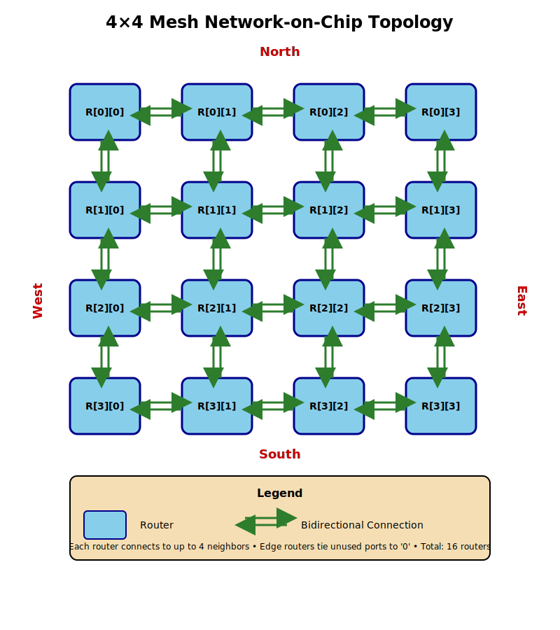
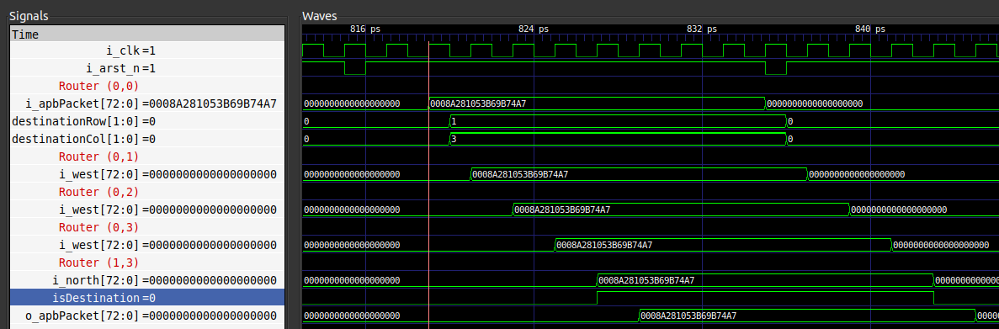

# Network On Chip

This repository contains a rudimentary implementation of a Network On Chip
(NOC).

## Preliminary

Here is a compilation of resources that helped me gain a better understanding.

**Lectures:**
1. [Lec 93 - Network-on-chip basics ](https://youtu.be/7-KJ3BnFsr8?si=_OVRzOOJtf1CBOBV)
2. [Lec 94 - NoC - topologies and metrics](https://youtu.be/ocyE11htZTk?si=3FIPpv9kX1Cwj1gj)
3. [Lec 95 - NoC - routing](https://youtu.be/wmqrgNKJrro?si=NOxIGlCZCNCAop3I)
4. [Lec 96 - NoC - switching and flow control ](https://youtu.be/Qq6C0DkklgU?si=7plMJajoXen2zAl9)

**Papers:**

(See `papers/`)
1. W. J. Dally and B. Towles, "Route packets, not wires: on-chip interconnection networks," Proceedings of the 38th Design Automation Conference (IEEE Cat. No.01CH37232), Las Vegas, NV, USA, 2001, pp. 684-689.
2. Network-On-Chip Design by Haseeb Bokhari and Sri Parameswaran.

## Architecture

This implementation consists of a **2D mesh Network-on-Chip (NoC)** with the following key components:

### Topology: 2D Mesh

The NoC uses a 2D mesh topology where routers are arranged in a grid pattern. Each router connects to:
- **Four neighboring routers** (North, South, East, West) - except edge routers which have fewer connections
- **Two local Network Interface (NI)**: one converts packets from the router to
a communication protocol that an IP block can understand; the other converts
a communication protocol from IP blocks to packets that can be routed.

### Packet Format

Packets are 73 bits wide (`APB_PACKET_WIDTH`) with the following structure:
- **Bits [1:0]:** Destination column coordinate
- **Bits [3:2]:** Destination row coordinate
- **Bits [72:4]:** Payload (69 bits)

### Routing Algorithm: XY Routing

Each router implements deterministic **XY routing**:
1. **X-dimension first:** Packets move horizontally (East/West) until reaching the destination column
2. **Y-dimension second:** Once aligned column-wise, packets move vertically (North/South) to the destination row
3. **Local delivery:** When router coordinates match the destination, the packet is forwarded to the local NI

This simple address-based routing eliminates the need for routing tables.

**NOTE: (for tag: v1.0.0)**
- The `GRID_WIDTH` parameter is fixed to 4. In a future release, the destination
row and column bit width will be parameterisable to support any mesh
configuration.

## RTL

### Module Hierarchy

- **[noc.sv](rtl/noc.sv):** Top-level module that instantiates the mesh

- **[mesh.sv](rtl/mesh.sv):** Interconnects routers in a 2D grid, handling all router-to-router connections and edge router boundary conditions


- **[router.sv](rtl/router.sv):** Individual router implementing XY routing logic with 10 ports (I/O from 4 neighbors + 2 local NI).

- **[pa_noc.sv](rtl/pa_noc.sv):** Package containing parameter definitions and packet format constants.

## Testbench

### Overview

[tb_noc.cpp](tb/tb_noc.cpp) is a Verilator-based C++ testbench that verifies the NoC functionality by sending random packets between routers and checking they arrive correctly at their destinations.

### Key Components

**Functions:**

1. **`writePacketToRandomRouter()`**: Injects test packets into the NoC
   - Constructs 73-bit packets with destination coordinates and payload
   - Maps packets to Verilator's 32-bit array representation (`i_niToRouter`)
   - Each router's packet spans ~2.3 array elements (73 bits across 32-bit boundaries)
   - Handles bit-level manipulation to correctly position packets in the input array
   - Logs transmitted packets with source, destination, and payload

2. **`readPacketFromDestinationRouter()`**: Validates received packets
   - Extracts packets from the output array (`o_routerToNi`)
   - Reconstructs 73-bit packets from 32-bit array elements
   - Strips routing information and verifies payload matches expected value
   - Reports verification success or failure with detailed error messages

### Test Sequence

The main simulation loop implements the following test pattern:

1. **Initialization** (cycles 0-5):
   - Apply reset for initial cycles
   - Release reset to allow NoC operation

2. **Random Traffic Generation** (after cycle 5):
   - Every 10 clock cycles: inject a packet with random source/destination
   - Source and destination routers chosen uniformly from the 4x4 grid
   - 64-bit random payload generated for each packet

3. **Packet Verification**:
   - Wait `GRID_WIDTH * 2` cycles after transmission (8 cycles for 4x4 mesh)
   - Read packet from destination router
   - Compare received payload with expected value
   - Trigger re-reset to flush the design between transactions

Example:
```
Time: 819 Sent packet from router (0,0) to router (1,3) with payload: 0x08a281053b69b74a
Time: 835 Received expected packet at router (1,3) with payload: 0x08a281053b69b74a
```

At time 819, the testbench writes to `i_niToRouter` such that router (0,0)'s `i_apbPacket` port receives a 73-bit packet:
- **Destination row [3:2]:** `0b01` (row 1)
- **Destination column [1:0]:** `0b11` (column 3)
- **Payload [72:4]:** `0x08a281053b69b74a`

The packet traverses the mesh via XY routing:
1. **East:** (0,0) → (0,1) → (0,2) → (0,3)
2. **South** (1,3)

At time 835 (16 cycles later), the packet arrives at router (1,3) and is verified at the `o_routerToNi` output. This is shown in the waveforms below:


### Limitations

As of tag v1.0.0, the purpose of the TB was to test whether the mesh structure
is functionally correct and packets can be routed.

- **Sequential Testing**: Only one packet in-flight at a time due to reset-based flushing between transactions
- **No Concurrent Traffic**: Cannot verify simultaneous multi-hop routing or network congestion scenarios
- **Fixed Latency Assumption**: Assumes worst-case latency of `GRID_WIDTH * 2` cycles for all paths
- **Reset Dependency**: Design must be flushed between transactions because routers lack internal FIFOs. Without buffering, residual packets from previous transactions can interfere with current traffic (see line 41 of `router.sv`)
- **Limited Coverage**: Does not test backpressure, flow control, or contention handling

Future RTL improvements should include FIFO-based buffering to enable realistic multi-packet scenarios without artificial resets.

### Building and Running

**Variables:**
- `MAX_SIM_TIME`: Total simulation duration (default 1000 clock edges)

```bash
cd tb
make all MAX_SIM_TIME=500
```

